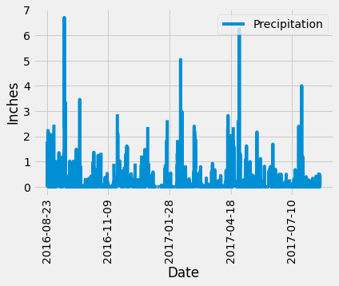
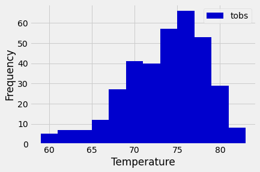

### sqlalchemy-challenge
This is an assignment for the University of Minnesota Data Analytics and Visualization Boot Camp.

# Surf's Up

Premise: Congratulations! You've decided to treat yourself to a long holiday vacation in Honolulu, Hawaii. To help with your trip planning, you decide to do a climate analysis about the area.

# Part One: Analyze and Explore Climate Data

This section of the assignment uses Python and SQLAlchemy to do a basic climate analysis and data exploration. Using the hawaii.sqlite database file with a Jupyter Notebook file, SQLAlchemy can be used to connect to the database via the create_engine() and automap_base() functions, as well as saving data to classes. The proper setup for this task involves creating a SQLAlchemy session in Python and closing the session at the end of the notebook.

## Precipitation Analysis (See climate_starter.ipynb)

In this section of the assignment, the following needed to be completed:
1) Find the most recent date in the dataset
2) Using that date, get the previous 12 months of precipiation data by querying the previous 12 months of data
3) Select only the "date" and "prcp" values
4) Load the query results into a Pandas DataFrame, and set the index to the "date" column
5) Sort the DataFrame values by "date"
6) Plot the results by using the DataFrame plot method
7) Use Pandas to print the summary statistics for the precipitation data

After completing these steps in Jupyter Notebook, the resulting chart is as follows:

Summary statistics:

## Station Analysis (See climate_starter.ipynb)

In this section of the assignment, the following needed to be completed:
1) Design a query to calculate the total number of stations in the dataset
2) Design a query to find the most-active stations
3) Design a query that calculates the lowest, highest, and average temperatures that filters on the most-active station id found in the previous query
4) Design a query to get the previous 12 months of temperature observations (tobs) data (and plot the results as a histogram)

After completing these steps, the histogram is as follows:

# Part Two: Climate App (See app.py)

Part Two of this assingment involves designing a Flask API based on the queries developed in Part One. This Flask API has homepage with all available routes listed, and five additional routes for users to find information. 